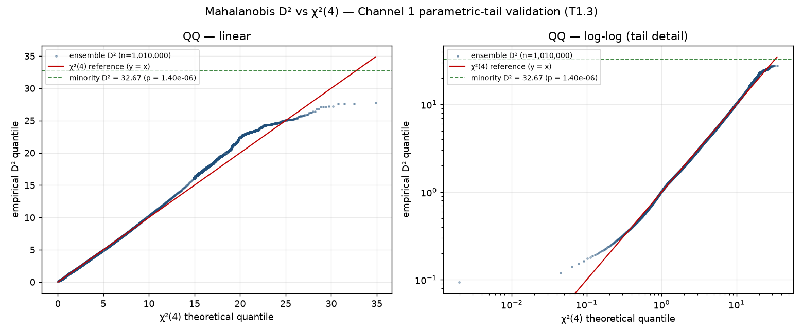

> **Backward:**
> - `analysis/scripts/joint_outlier_score_canonical.py` — Ch1 Mahalanobis pipeline (same μ, Σ, pinv construction)
> - `data/simulation_checkpoints_canonical/chain*_samples.csv` — canonical ensemble
> - TODO_REMEDIATION T1.3 (Mahalanobis tail validation), T1.9 (empirical-floor honesty)
>
> **Forward:**
> - `reports/academic/report_academic.md` §5.4.9 / §5.5 — Ch1 χ²(4) tail
> - `findings/joint_outlier_score_summary.md` — Ch1 p = 1.40×10⁻⁶

# Mahalanobis D² vs χ²(4): does the parametric tail hold?

## Why this matters

Channel 1's headline — minority map at **D² = 32.67 → χ²(4) p = 1.40×10⁻⁶** — is
a *parametric* extrapolation. T1.9 established that the empirical floor over the
1.01M **autocorrelated** draws is ESS-bounded at ≈ 6.7×10⁻⁴, far coarser than
1.40×10⁻⁶, so the empirical ensemble cannot by itself resolve a tail this deep.
The χ²(4) reference is what carries the finding into the deep tail. This document
asks the question that obligation creates: **does the ensemble's D² statistic
actually follow χ²(4), especially in the upper tail?**

Method (identical covariance construction to the published Ch1 pipeline): pool
the four canonical chains, μ = column mean, Σ = `np.cov`, Σ⁺ = `pinv(Σ)`, and
compute D²ᵢ = (xᵢ − μ)ᵀ Σ⁺ (xᵢ − μ) for all 1,010,000 plans. The minority map
reproduces at D² = 32.6692 (D = 5.7157), χ²(4) p = 1.396×10⁻⁶ — the published
value to three significant figures, confirming the pipeline is faithfully
reconstructed from the chain CSVs.

## Result — good in the bulk, mildly heavy in the tail



| Quantile | Empirical D² | χ²(4) D² | Δ (emp − χ²) |
|---|---:|---:|---:|
| p50 | 3.318 | 3.357 | −0.038 |
| p90 | 7.801 | 7.779 | +0.022 |
| p99 | 13.925 | 13.277 | +0.648 |
| p99.9 | 20.004 | 18.467 | +1.537 |
| p99.99 | 24.453 | 23.513 | +0.940 |

- **Bulk fit is excellent.** Empirical mean D² = 4.000 (χ²(4) mean = 4.000;
  this is mechanical for any covariance), and the body of the distribution up to
  ≈ p95 tracks the y = x reference tightly. The log-log panel shows fit across
  three orders of magnitude; the only visible departure at the *low* end is the
  expected granularity from the discrete `seats_at_50_50` coordinate (one of 89
  seat counts).
- **The upper tail is mildly HEAVIER than χ²(4).** Variance is 8.524 vs the
  χ²(4) value 8.000 (**+6.5 %**), and the p99–p99.99 quantiles run **+0.6 to
  +1.5** above the χ²(4) reference. The honest reading: **χ²(4) mildly
  *understates* the p-value (overstates the rarity) in the p99–p99.99 band — it
  is mildly anti-conservative there**, not conservative. This is the kind of
  light-to-moderate tail thickening expected when one of four coordinates is
  discrete and the metrics are mildly non-Gaussian.

## Why the headline survives the heavy tail

The mitigation is **empirical, not parametric**:

1. **The minority map is beyond all empirical mass.** Its D² = 32.67 exceeds the
   heaviest of all 1,010,000 ensemble plans (**empirical max D² = 27.74**); zero
   plans reach it. Its status as an extreme multivariate outlier is therefore
   *empirically unambiguous and independent of the χ²(4) calibration* — the
   parametric form only supplies the number on the p-axis, not the fact of the
   outlier.
2. **The published headline already carries two conservative hedges** that
   absorb a tail this much heavier than χ²(4):
   - the n_eff-adjusted Hotelling-F p = **1.73×10⁻⁶** (accounts for the
     covariance being estimated from a finite effective sample), and
   - the dependence-robust **Bonferroni 2× bound, p ≤ 2.80×10⁻⁶** (the joint
     headline), corroborated by the Cauchy combination (T1.2).
   A +6.5 % variance inflation and a ~+1.5 shift at p99.9 are comfortably within
   the factor-of-two margin those hedges already build in.

## Honest bottom line

χ²(4) is a **good but not perfect** model for the ensemble D²: faithful in the
bulk, mildly anti-conservative in the moderate tail. The audit should not (and
does not) claim the χ²(4) tail is conservative. It claims something narrower and
defensible: the minority map sits beyond the heaviest of one million neutral
draws, so its outlier status does not depend on the parametric tail; and the
conservative figures the audit already publishes (Hotelling-F 1.73×10⁻⁶,
Bonferroni 2.80×10⁻⁶) leave ample margin for the observed tail thickening. This
closes T1.3's outstanding QQ-validation item.

## Reproducibility

```bash
python analysis/scripts/mahalanobis_qq_validation.py
# -> findings/mahalanobis_chi2_qq_validation.png
#    findings/mahalanobis_chi2_qq_validation.json
```
