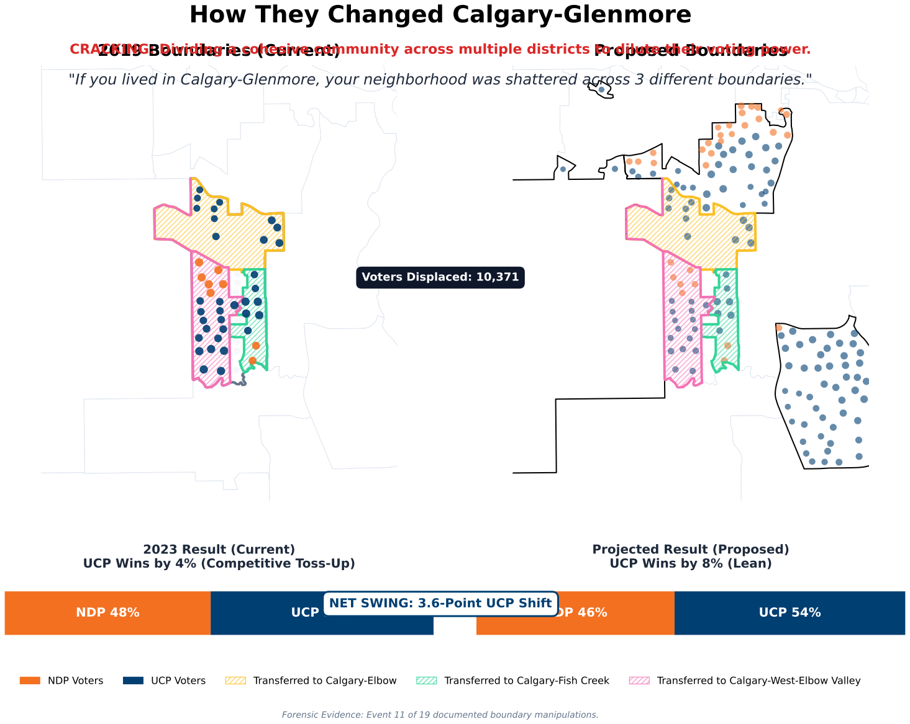

# Two Maps, Then None: Inside Alberta's 2026 Boundary Audit

*A plain-language look at the 2025–26 Electoral Boundary Commission, the math behind the minority map, and what comes next.*
*v0.25 — April 28, 2026 — [Full academic monograph](https://github.com/Ixby/alberta-electoral-boundaries-audit/blob/master/report_academic.md)*

---

## Part I: How the Commission Broke

On March 23, 2026, Alberta's Electoral Boundary Commission did something highly unusual: it deadlocked. After months of public hearings, the five commissioners could not agree on a single map. Three commissioners published the "majority map"; the other two published a competing "minority map." 

Both maps are legal under the rules. But on April 16, the government set both of them aside. Instead, the task of drawing Alberta's next electoral map was handed to a five-member legislative committee of MLAs.

This audit looks at the two maps the commission produced. By measuring them, we can establish a clear mathematical baseline for whatever map the new committee produces in November.

When run through 250,000 computer-simulated neutral maps, the majority map looks like a standard reflection of Alberta's natural geography. The minority map does not. While it looks perfectly normal on standard, high-level fairness tests, the minority map possesses a structural configuration that pushes its tipping-point advantage into the top 1.5% of what is mathematically possible. 

---

## Part II: The 250,000-Map Litmus Test {.new-page}

A gerrymander happens when a map is drawn to give one political side an advantage beyond what the rules require. But intent is impossible to read off a map. All we can measure is the effect.

The most common defense of conservative-favorable maps in Alberta is that the province's natural geography leans that way: NDP voters are heavily concentrated in Edmonton and Calgary cores, while UCP voters are efficiently spread across rural ridings. 

To separate natural geography from deliberate mapping choices, this audit used a computer algorithm to draw **250,000 legal Alberta maps** under the exact same rules the commission used. This creates a "Bell Curve" of natural maps.

### The 50/50 Tipping Point

The cleanest way to test a map is to ask: If the province's vote split exactly evenly (50/50) between the UCP and the NDP, how many seats would the map award the UCP?

*   **The Median Alberta Map (Neutral):** 44.8% of seats.
*   **The Majority Map:** 46.1% of seats (77th percentile — inside the normal range).
*   **The Minority Map:** 48.3% of seats (**98.57th percentile — the top 1.5%**).

Out of 250,000 neutral maps, only 1.5% reached this level of tipping-point advantage. The majority map aligns with the routine output of a neutral computer. The minority map sits as an extreme statistical outlier.

---

## Part III: Cracking, Packing, and Draining

A map reaches the extreme edge of mathematical possibility by using three specific boundary configurations. These are established industry terms in redistricting analysis:

1. **Cracking:** Dividing a cohesive voting community across multiple districts to dilute its total voting power. Instead of staying intact, the community is fractured and attached to adjacent districts where their votes are drowned out.
2. **Packing:** Concentrating specific voter blocs from multiple adjacent areas into a single district. This creates a safe seat won by an overwhelming supermajority (e.g., 85%), effectively wasting thousands of ballots that could have been competitive elsewhere.
3. **Draining:** Attaching dense urban neighborhoods to expansive rural or suburban peripheries. By ignoring municipal boundaries and linking urban cores to surrounding service centers, urban voting power is diluted across the broader region.

On the minority map, these configurations define the geometry.

---

## Part IV: The Impact on the Ground {.new-page}

While computer algorithms prove the statistical imbalance, the actual boundary choices happen block by block, city by city. 

The audit evaluated the two maps against five pre-registered structural irregularity tests. The majority map crossed zero thresholds. The minority map crossed all five, primarily due to how often it ignored existing municipal borders (aligning with city limits on only 15% of its perimeter, compared to a Canadian norm of 70-85%).

Here is what that geometry looks like on the ground.

### Exhibit A: The Airdrie Four-Way Split (Cracking)
Airdrie is the largest Alberta city without its own MLA. At 84,000 residents, it has a single council, tax base, and school division. The majority map divided it into two districts. The minority map divided it into four.

By fracturing Airdrie into four ridings (each anchored to different rural or Calgary-edge districts), the minority map results in a city of 84,000 residents having zero seats in the legislature where a majority of voters actually live within the city limits. 

### Exhibit B: The Lethbridge Drain (Draining)
The City of Lethbridge has a population of 100,000. Under the minority map, it contains **zero** pure-Lethbridge ridings. 

Every Lethbridge voter is grouped with an out-of-city community. By grouping urban voters into the Cardston, Taber, or Crowsnest Pass districts, the minority map structurally dilutes the influence of the localized urban electorate.

### Exhibit C: Calgary-Glenmore (Packing)
In Calgary's northwest quadrant, the minority map's divisions average 11.5% above the province-wide population target—versus 2.8% on the majority map. 

*(Note: While the majority map crossed no structural thresholds globally, forensic analysis reveals localized packing patterns in key battleground zones like Calgary-Glenmore under both proposals).*

---

## Part V: How "Clean Gerrymanders" Work {.new-page}

If the minority map exhibits these structural patterns, why didn't it trigger immediate disqualification under standard fairness tests? Because it maintains a conventional, smooth geometric profile.

As computational redistricting advances, mapmakers avoid visibly jagged, non-compact shapes. Instead, they draw maps that strict adherence to basic population and compactness rules, successfully evading standard structural tripwires.

### The Efficiency Gap vs. The Stealth Gerrymander Ratio
Standard audits evaluate partisan bias (like the Efficiency Gap) and structural integrity (like compactness) in isolation. The minority map appears mathematically unremarkable on the global Efficiency Gap metric (+1.8%, sitting at the 58th percentile). 

However, introducing the **Stealth Gerrymander Ratio (SGR)**—which calculates the ratio of partisan efficiency against structural compactness penalties—clarifies the data. The minority map does not alter safe rural seats. It demonstrates a highly concentrated structural shift specifically at the marginal, 50/50 hybrid districts.

### Abusing Section 15 (Internal Density Variance)
Under the *Electoral Boundaries Commission Act*, **Section 15** permits mapmakers to bypass standard population parity limits (+/- 25%) to provide effective representation for isolated, remote communities.

The **Internal Density Variance (IDV)** metric mathematically evaluates these variances. A naturally cohesive remote district maintains a flat IDV. When mapmakers attach hyper-dense urban cores to sparsely populated rural peripheries to claim a variance, the IDV ratio expands exponentially (e.g., a 5,000x difference between the densest and sparsest blocks). This ratio confirms whether a district is a naturally cohesive remote community, or a mathematically engineered "Hub-and-Spoke" drain.

---

## Part VI: What Happens in November

Electoral boundaries are not just mathematical abstractions. They determine whether a community's voice is heard in the legislature, or whether it is fractured and drowned out. When a city like Airdrie is split four ways, or a city like Lethbridge is drained into the periphery, there are real personal and political consequences for the voters who live there. It dictates who they call for help, and whether their representative answers to their community or to someone else's.

On April 16, the government chose to set aside the work of the independent commission. The task of drawing Alberta's 2027 map now rests with a legislative committee chaired by the governing party. This is a rare and consequential decision, and it places an extraordinary burden of proof on the committee to demonstrate that its final map is fair.

When that 91-seat map is published in November, Albertans will know exactly what to look for. We know what a natural map looks like. We know how to identify Cracking, Packing, and Draining. We know that a map can look mathematically innocent on the surface while masking a surgical tipping-point advantage.

The standard for the upcoming November redraw is established here. The evaluative baseline is locked. The 250,000-map ensemble is finalized, and the structural irregularity tripwires are pre-registered.

When the legislative committee releases its map, this exact audit pipeline will ingest the shapefiles, run the mathematics, and publish the results the same day. 

The initial maps have been retired, but the test is waiting.

---
*The full technical monograph, with all methods, caveats, and source citations, is available at [github.com/Ixby/alberta-electoral-boundaries-audit](https://github.com/Ixby/alberta-electoral-boundaries-audit). All code is open source and reproducible end-to-end.*
